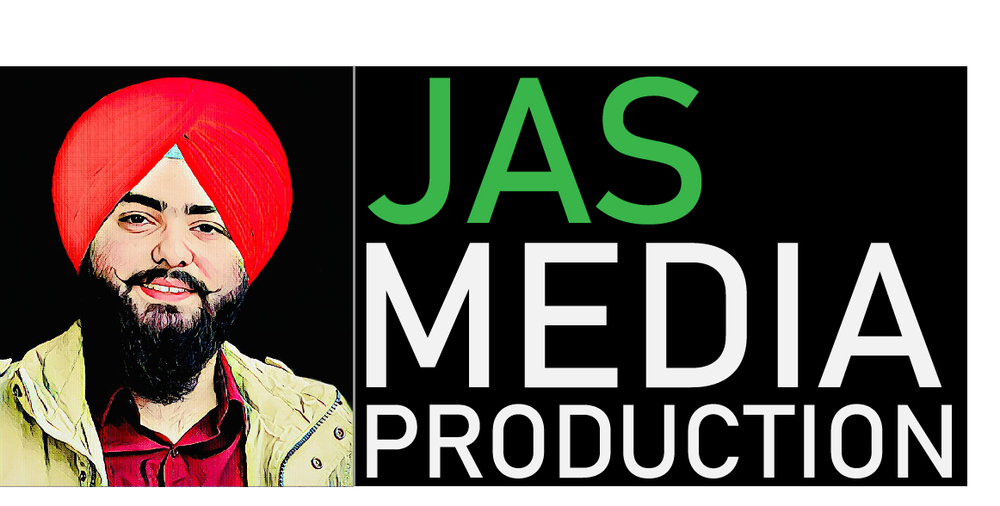

# Singh_J_AV_Accessibility
This project includes an awesome A/v Application. This is assignment that helps users to view videos with caption. also includes the audio with lyrics. 

## Getting started
These instructions will let you know how to open this interesting page of my favourite things. See Deployment for notes on how to deploy the project on your Mac/Pc.
## To view, follow the steps below:-
Steps :-
1. Clone or download zip file of the project in your live system.
2. Extract the files in the folder of your choice.
3. Open the folder named Singh_J_av_accessiblity in Visual studio code. 
4. the A/V app will work on www.localhost/singh_j_av_accessibility .

## Prerequistes
To run the index.html file , you will require to install browser such as google chrome or firefox.

## Author
JASKARAN SINGH

## License
The project is copyright of MIT.